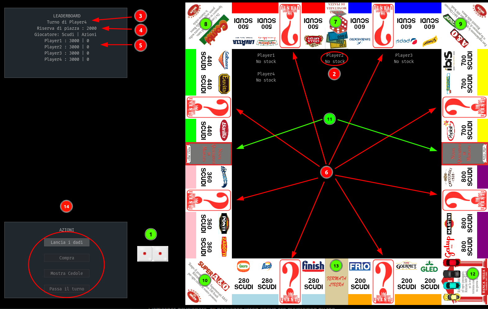
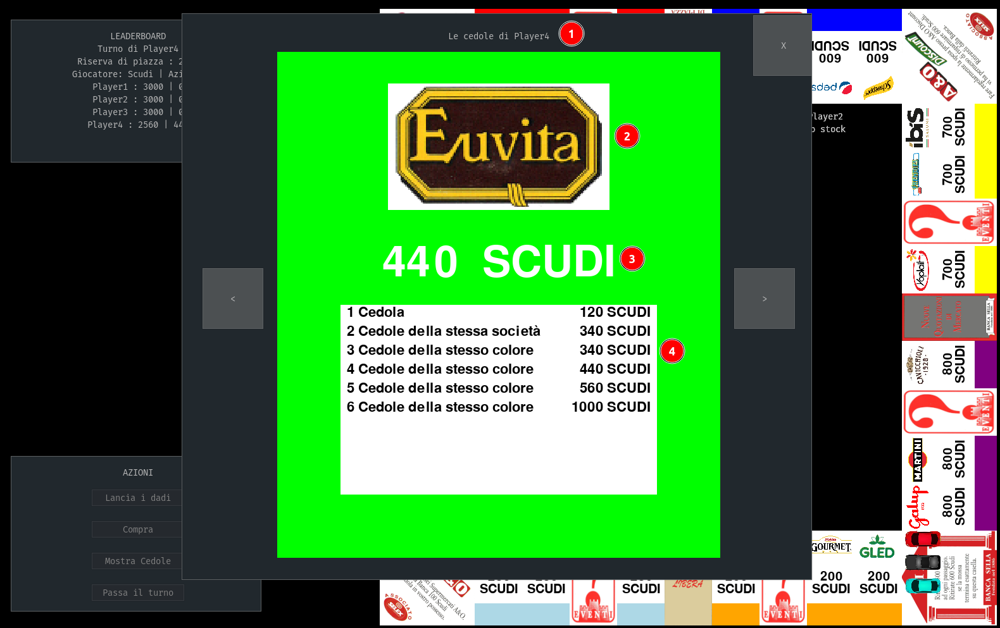
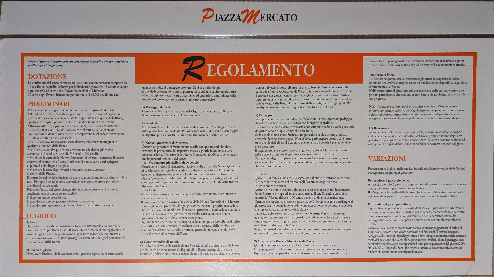

# PyazzaMarket
It's the Python edition of an Italian game from the 90s called Piazza Mercato. Piazza Mercato was a multiplayer board game similar to Monopoly, for the moment we are building the single computer version sooner we will add AI players and network capabilities.

⚠️ This game is still in beta, we still need to fix some things. The GUI and the rules are still in Italian, the comments in the code instead are in English. ⚠️

## Board of our game

1. The dice: last score of the dice.
1. Stockboard where the players can see the stocks that they own.
1. Indicate which is the player that is playing the current turn.
1. The money of the square: It show how much money there is in the square reserve.
1. The money and the value of the stocks for each player.
1. Event cells: when you finish in this cells there are 70 possible events that can occur.
1. Chance cell: when you fall on this cell, you throw one dice and if you obtain a number between 1 and 3 you lose money against the square, if you obtain a number between 4 and 6 you win money against the square.
1. Relocate cell: when you fall on this cell, you can chose on which stock cell to move and decide if you want to buy it.
1. Reward cell: you obtain 600 Scudi.
1. Stock prize cell: you obtain 100 Scudi for each stock that you own.
1. New quotation cells: When you fall on this cell, every stock could change its value and after the changes an auction will occur and every player has to put one of his stock in the auction.
1. Start cell: when you fall on this cell you obtain 600 Scudi, instead if you pass without falling on it you obtain 300 Scudi.
1. Free stop cell: When you fall on this cell you can choose which stock to buy, after that you can also start a negotiation with the other players.
1. Actions: these are the buttons to interact with the game, the first is used to throw the dice, the second to buy a stock, the third to show the stocks that the current player owns and the last to pass the turn to the next player.

## An example of a stock

1. The owner of the stock.
1. The logo of the stock.
1. The current value of the stock.
1. The current penalties of the stock.

## Rules

# License
The software is released under the GNU General Public License (GPL) which can be found in the file [LICENSE](https://github.com/DarkRaider95/PyazzaMarket/blob/main/LICENSE) in the same directory as this file.

# Dependecies
- pygame
- pygame-gui
- pytest
- black (code styling)